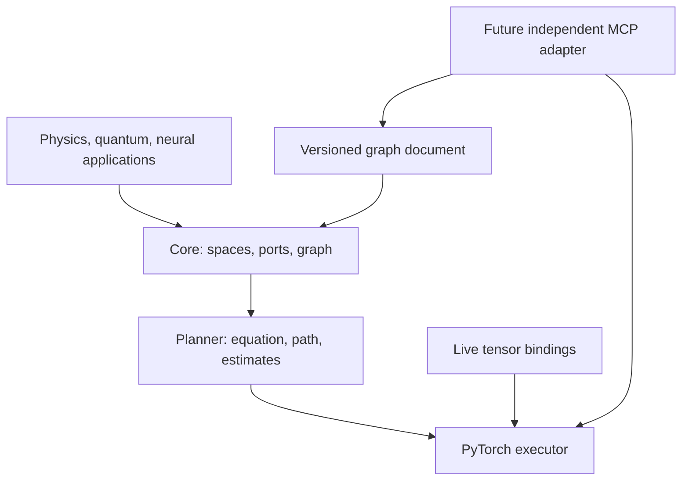

# Architecture

Ricci uses an immutable intermediate representation (IR) for mathematical tensor
contractions. Data binding is separate, so the same expression can be validated,
planned and executed repeatedly with fresh operands. Mathematical metadata never
depends on device placement, GPU initialization or a remote process.

## Module responsibilities

| Module | Owns | Must not own |
| --- | --- | --- |
| `core/index.py` | Space identity, size, basis/fiber, variance | Arrays, metrics inferred from dimension |
| `core/graph.py` | Ordered occurrences, edges, retained batches, output contract | Autograd or execution state |
| `core/compiler.py` | Structural lowering to explicit Einstein notation | Optimization, tensor values |
| `planning` | Bounded path cache, strategy, cost estimates | Result cache, learned parameters |
| `backends/torch.py` | Dense execution, shape/dtype/device checks, live tensors | Silent casts, detached copies, networking |
| `physics` | Explicit metric/bilinear-form application | Chart calculus or GR field equations |
| `quantum` | Orthonormal-basis inner products | Implicit bra conversion of general geometric tensors |
| `nn` | Neural helpers composed with PyTorch | Claim that nonlinear networks are pure contractions |
| `interop` | Optional Pydantic graph document | ScientificResult duplication or tensor transport |

Domain helpers compose the core rather than subclassing graphs and overriding
validation. The first backend is concrete PyTorch; a backend protocol should be
extracted only when a second implementation has real requirements. Avoid a general
plugin registry, dependency injection framework or GPU scheduler in this library.

## Lifetime and ownership

`IndexSpace`, `Index`, `NodeSpec`, `Port`, `Edge`, `BatchGroup`, `Graph`, `ContractionIR`
and `Plan` are frozen. Sequence inputs are normalized to tuples at the IR boundary.
`Node` is a frozen wrapper around a mutable caller-owned tensor; it does not freeze
storage, intercept in-place operations, or register neural parameters automatically.

`plan()` caches at most 128 plans keyed by graph, strategy and size budget.
Values contain only metadata and paths. New data bindings are checked every time;
changed dimensions require a new graph/plan. No constants cache or retained graph
is shared across training steps. `plan.cache_clear()` releases plan metadata.

`direct` delegates to torch.einsum, whose internal planning may depend on installed
optional packages. `greedy`/`auto` select an explicit opt_einsum path. Estimates
refer to algebraic FLOPs and largest intermediate element count, not measured
wall time or total memory (especially during backward).

## Boundaries and extension points

The v0.1 compiler caps the number of distinct wire labels at 52, matching a single
PyTorch einsum invocation. The graph identity is independent of this encoding.
A future stepwise lowering can reuse symbols between contractions to lift that
limit without changing public port identity.

Ordinary contraction edges are binary. Batch groups support multiple operands
while retaining one output axis. General component hyperedges, diagonals retained
within a node, broadcasting and batch reduction need explicit future semantics.

QR/SVD will take a partition of ports, create a new bond space and report truncation
error. Geometry will model fields and connections separately from pointwise tensors.
MCP will call the library through an independent package: no circular dependency on
MCP One, the stack, network transport or deployment manifests.

See [ADRs](adr/0001-explicit-spaces.md), [mathematics](mathematics.md) and
[MCP integration](mcp-integration.md).
